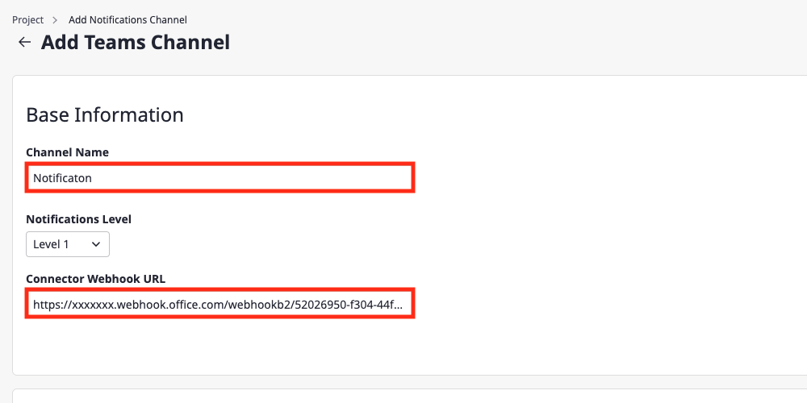

## 개요

클라우드포레에서 MS Teams 플러그인을 사용하기 위해서 [**Channel Name**], [**Connector Webhook URL**]에 대한 설정이 필요합니다. 
본 설정 가이드는 위 두 가지 정보를 획득하는 방법에 대해 자세히 알아보도록 하겠습니다.

> 💡 MS Teams에 최소 1개의 팀과 채널이 존재하거나 생성할 수 있어야 합니다.  
> MS Teams 팀 생성에 대한 자세한 설명은 [MS Teams Documentation](https://support.microsoft.com/en-us/office/Teams-and-channels-df38ae23-8f85-46d3-b071-cb11b9de5499#ID0EBBD=For_team_owners)을 참고하십시오.  
> MS Teams 채널 생성에 대한 자세한 설명은 [MS Teams Documentation](https://support.microsoft.com/en-us/office/create-a-standard-or-private-channel-in-teams-fda0b75e-5b90-4fb8-8857-7e102b014525)을 참고하십시오.  

 
 

## 전체 흐름

진행 순서는 아래와 같으며 가이드에서 제시한 순서와 같이 진행해주시기를 바랍니다.

1. [MS Teams Incoming Webhook Connector 생성](#1-ms-teams-incoming-webhook-connector-생성)
2. [MS Teams Incoming Webhook Connector 확인(선택)](#2-ms-teams-incoming-webhook-connector-확인선택) 
3. [클라우드포레에서 MS Teams 채널 등록](#3-클라우드포레에서-ms-teams-채널-등록)

클라우드포레에서 MS Teams 채널을 등록하는 방법에 대해 간략히 설명해보겠습니다.

우선 알림을 보내고 싶은 채널에 대한 커넥터를 생성합니다. 그 다음 Incoming Webhook URL을 발급받습니다.
이후 발급받은 정보를 클라우드포레에 입력하면 클라우드포레에서 생성된 알림을 MS Teams 채널을 통해 전달받을 수 있습니다.

 
 

## 1. MS Teams Incoming Webhook Connector 생성

MS Teams 채널에 알림(Notification)을 전송하기 위해서 Incoming Webhook 커넥터 설치가 필요합니다. 
이 과정을 통해 **Channel Name** 과 **Connector Webhook URL** 정보를 얻을 수 있습니다.

 

(1-1) Teams를 실행 후 왼쪽에 [Teams] 아이콘을 클릭합니다.

(1-2) 알림을 보낼 채널에 이름 오른쪽에 [···] 버튼을 클릭합니다. 
여기에서 채널 이름이 **Chnanel Name**에 해당하는 값이 됩니다.
> 💡 **Channel Name**은 Teams의 채널 이름과 동일할 필요는 없습니다. (사용자 임의 설정 가능)

(1-3) 커넥터 생성을 위해 [Connectors] 버튼을 클릭합니다.

 

(2) [Configure] 버튼을 클릭합니다.
> 추가가 되어 있지 않다면 [Add] 버튼을 먼저 눌러 주세요.

 

(3-1) 커넥터의 이름을 입력합니다.

(3-2) [Create] 버튼을 클릭합니다.

 

(4-1) [복사하기] 아이콘 버튼을 클릭합니다. 
여기서 복사한 데이터가 **Connector Webhook URL** 정보입니다.

(4-2) 복사 완료 후 [Done] 버튼을 클릭합니다.

 
 

## 2. MS Teams Incoming Webhook Connector 확인(선택)

이미 생성된 Incoming Webhook Connector의 정보를 확인하는 단계이므로 생략할 수 있습니다.

 

(1-1) Teams를 실행 후 왼쪽에 [Teams] 아이콘을 클릭합니다.

(1-2) 알림을 보낼 채널에 이름 오른쪽에 [···] 버튼을 클릭합니다.

(1-3) 커넥터 [Connectors] 버튼을 클릭합니다.

 

(2) [Configured] 버튼을 클릭합니다.

 

(3-1) [Configured] 버튼을 클릭합니다.

(3-2) [Manage] 버튼을 클릭합니다.

 

(4) **Connector Webhook URL** 정보를 확인합니다.

 
 

## 3. 클라우드포레에서 MS Teams 채널 등록

이제 클라우드포레의 MS Teams 채널 등록을 위한 준비가 끝났습니다. 
지금까지 설정 가이드를 진행하면서 얻은 설정 정보를 입력하면 채널 등록을 완료할 수 있습니다.

- Channel Name: 알림을 보낼 채널의 이름
- Connector Webhook URL : 커넥터 생성을 통해 얻은 URL 정보

 

(1-1) Channel Name 정보를 입력합니다.

(1-2) Connector Webhook URL 정보를 입력합니다.

(1-3) [저장] 버튼을 클릭합니다.

 

(2-1) [얼럿] 탭을 클릭합니다.

(2-2) MS Teams 채널이 추가된 것을 확인할 수 있습니다.

 

(3-1) 테스트 얼럿(Alert)을 발생시켜 Teams를 통해 알림(Notification)이 오는지 확인해 보겠습니다.

(3-2) 작성한 내용과 같이 알람이 전송된 것을 확인할 수 있습니다.

지금부터 MS Teams 채널을 통해 얼럿(Alert)을 수신받을 수 있습니다.
